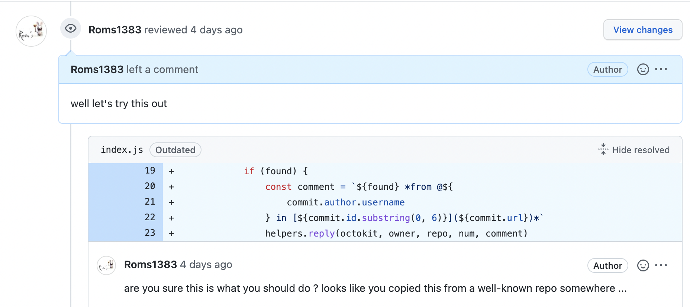
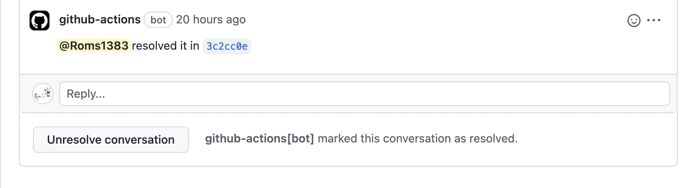
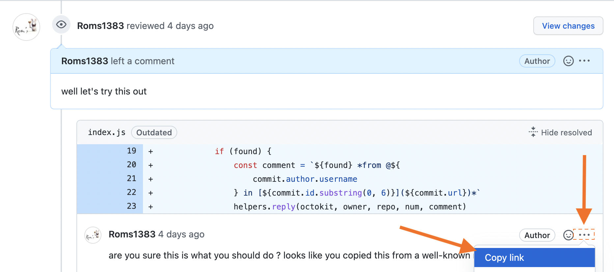

# :speaking_head: emissary


[](https://codecov.io/gh/Roms1383/emissary)
[](https://opensource.org/licenses/MIT)

This Github Action allows your contributors to resolve requested changes from a pull request review thread directly from their commit message.

## why ?

Github already supports e.g. `fix #1` [in commit message](https://github.blog/2013-01-22-closing-issues-via-commit-messages/) to automatically close the related issue, but as far as I know there's currently no means to do so for a pull request review conversation.

This Github Action basically spare your contributors from having to go back to the PR, manually commenting / resolving the conversation in their browser.

Also to simplify a maintainer review process, a contributor might want to dutifully report in which commit (s)he carried out which one of the requested changes, which is exactly what this Github Action does.




## setup

You want this action to run on pull requests, so something like:

```yaml
name: CI
on: push

jobs:
  # other jobs ...
  action:
    name: Reply to PR review from Commit
    runs-on: ubuntu-latest
    # needs: unit-tests <-- usually you want some previous jobs to succeed first (e.g. linter, unit-tests, etc)

    steps:
      - name: checkout repository
        uses: actions/checkout@v3
      - name: setup NodeJS
        uses: actions/setup-node@v2
      - name: install dependencies
        run: npm ci

      - uses: Roms1383/emissary@v1
        with:
          token: ${{ secrets.GITHUB_TOKEN }} # required to act in Github on your behalf
```

## usage

1. setup the Github Action in your workflow [as shown in previous section](#setup).
1. comment your commits like so, e.g.:

   ```git
   chore: improve documentation

   add example to the latest awesome feature.
   resolve discussion DISCUSSION_NUMBER
   ```

   :warning: `resolve` will reply to the conversation **AND** resolve it

   > (which is usually what you want for trivial changes that doesn't require extra attention from the maintainer)

   or

   ```git
   feat: add new CLI argument

   add an additional argument for the new feature.
   reply discussion DISCUSSION_NUMBER
   ```

   :warning: `reply` will **only** reply to the conversation, leaving it up to the maintainer to resolve it or not

   > (which is usually what you want for non-trivial changes)

   :arrow_right: the `DISCUSSION_NUMBER` can be found under **Copy Link** on the comment requesting changes:

   

   it should looks like, e.g. `https://github.com/<OWNER>/<REPO>/pull/1#discussion_r937716034` where `937716034` is the discussion number: either full url or its discussion number are supported in the commit message.

1. on Github Action successful completion, just refresh your page you should now see in your PR, e.g.:

   

This Github Action supports a couple of different spelling, that you can check [from the unit-tests](tests/utils.test.js).

## how ?

This Github Action:

- does not act on your main branch
- does not act when a pull request is freshly created
- does not act when a pull request is deleted
- does not act when commits are not distinct or have been force-pushed

simply because its main purpose is to facilitate ongoing PR reviews.

It will however fetch any **opened** PR associated with the commit, read through its **unresolved** threads to find comment marked to reply to or resolve.

## roadmap

Although functional, this action is in its early stage, has a couple of rough edges, and lack extensive tests.

Depending on feedbacks, I might consider putting more time and effort into it, and you're also welcome to bring your own contributions!
